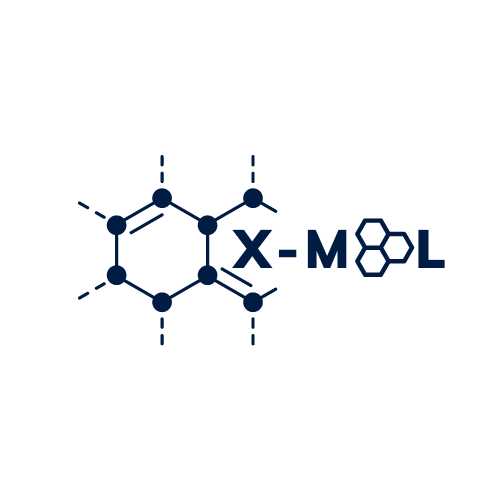

<br />
<div align="center">
  <a href="https://github.com/Hrishikesh332/Chem-Master">
    
  </a>

  <h3 align="center">X - Mol</h3>

  <p align="center">
    X - Mol - World of Chemistry 
    <br />
    <a href="https://github.com/Hrishikesh332/Chem-Master"><strong>Explore the docs »</strong></a>
    <br />
    <br />
    <a href="https://github.com/Hrishikesh332/Chem-Master">View Demo</a>
    ·
    <a href="https://github.com/Hrishikesh332/Chem-Master/issues">Report Bug</a>
    ·
    <a href="https://github.com/Hrishikesh332/Chem-Master/issues">Request Feature</a>
  </p>
</div>

## Do Check Out ExPro 🔬:

[](https://hrishikesh332-chem-master-app-26iy0f.streamlit.app/)

<details>
  <summary>Table of Contents</summary>
  <ol>
    <li><a href="#About">About</a></li>
    <li><a href="#Features">Features</a></li>
    <li><a href="#Tech-Stack">Tech Stack</a></li>
    <li><a href="#Languages-and-Tools">Languages and Tools</a></li>
    <li><a href="#Instructions-on-running-project-locally">Instructions on running project locally</a></li>
    <li><a href="#Contributing">Contributing</a></li>
    <li><a href="#Guide">Guide</a></li>
    <li><a href="#Feedback">Feedback</a></li>
    <li><a href="#Support">Support</a></li>
    <li><a href="#License">License</a></li>

  </ol>
</details>

------

## About

X-Mol aims to provide the platform to explore the world of chemistry 🌎. It helps to understand the chemical structure in a better manner by interacting with the 3D chemical structure and also the nomenclature from SMILES 😊. The application also focuses on teaching the rules, examples and resources to follow up.

To remove the fear of nomenclature of chemical structure and also to draw the structure ⌬. Making Logic clear would help individual solve more complex question. X-Mol also contains the practice problems of various difficuly level 🎚️. 

To make student feel competitive, interested and enthusiastic to solve & understand more number of chemical structure by attempting the quiz and scoring in it 💯. The molecular formula and chemical structure are the base of the chemistry to go more beyond towards the chemical reaction. The goal is to provide the platform to make the application which makes "General Organic Chemistry" more strong 🏆.


## Features

⌬ Platform helps to advocate on Chemical Structure, Molecular Formula, and Nomenclature

🔬 ChemQuiz - To help student to remember the concepts and learn something new about chemical compounds. It also helps to enhance the knowledge to learn something new. Also, the large amount of problems help to skill up!

🧪 Scanning Chemical Structure to Nomenclature and SMILES


## Languages and Tools

<p align="left"> <a href="https://streamlit.io/" target="_blank" rel="noreferrer">  </a> <a href="https://firebase.google.com/" target="_blank" rel="noreferrer">  </a> <a href="https://huggingface.co/" target="_blank" rel="noreferrer">  </a><a href="https://www.python.org/" rel="noreferrer">  </a>
<a href="https://www.python.org/" rel="noreferrer">  </a>
 
 

 
 ## Instructions on running project locally:

Clone the project

```bash
  git clone 
```

Install dependencies:

```bash
  pip install -r requirements.txt 
```
  

Run Project 

```bash
  streamlit run app.py
```


## Authors

🔆 [@Hrishikesh Yadav](https://www.github.com/hrishikesh332)


## Contributing

Contributions are always welcome!

See `CONTRIBUTING.md` for ways to get started.

Please adhere to this project's `CODE_OF_CONDUCT.md`.

## Guide

A guideline of project composition and creation.

soon adding `guide.md`

Please adhere to this project's `CODE_OF_CONDUCT.md`.

## Feedback

If you have any feedback, please reach out to us at **hrishikesh3321@gmail.com**


## Support

For support join our Slack channel - [AMA](https://ml-geeksworkspace.slack.com/archives/C03K2M9SBAA)

## License

[](https://www.gnu.org/licenses/gpl-3.0)
